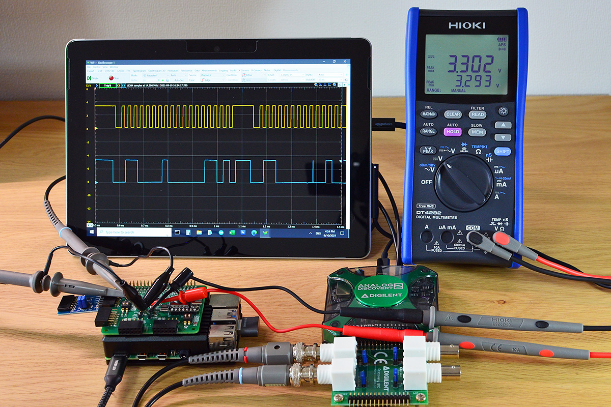

# Pi-MMC33416


## Background

This is a C driver program for operating a Memsic MMC33416xPJ magnetic sensor via I2C on a Raspberry Pi. I used it with the Digilent CMPS2 PMOD module, connected to the PMOD4 port of the PMOD2RPI board on a Raspberry Pi 4. On a standard Pi, the I2C bus already has 1k8 pull-ups to 3V3 and the module's pull-up jumpers are kept open.

[MEMSIC MMC3416xPJ datasheet](http://www.memsic.com/uploadfiles/2020/08/20200827165224614.pdf)

  CMPS2 PMOD module during I2C check on a PMOD2RPI interface board

## I2C bus connection


For I2C communication functions, I am using the i2c-tools and i2c-dev packages.

```
sudo apt-get install -y i2c-tools libi2c-dev
```
Now we can use the i2cdetect command to query the I2C bus. The Memsic MMC3416xPJ sensor address is factory-hardcoded from 0x30 to 0x38. The address is part of the ordering type name: MMC34160PJ = 0x30, MMC34161PJ = 0x31, and so forth. The Digilent CMPS2 PMOD module uses MMC34160PJ at address 0x30:

```
root@pi-ws01:/home/pi# i2cdetect -y 1
     0  1  2  3  4  5  6  7  8  9  a  b  c  d  e  f
00:          -- -- -- -- -- -- -- -- -- -- -- -- --
10: -- -- -- -- -- -- -- -- -- -- -- -- -- -- -- --
20: -- -- -- -- -- -- -- -- -- -- -- -- -- -- -- --
30: 30 -- -- -- -- -- -- -- -- -- -- -- -- -- -- --
...
70: -- -- -- -- -- -- -- --
```

## Code compilation

Compiling the test program:
````
pi@pi-ms05:~/pmod2rpi/pi-mmc3416 $ make
gcc -O3 -Wall -g   -c -o i2c_mmc3416.o i2c_mmc3416.c
gcc -O3 -Wall -g   -c -o getmmc3416.o getmmc3416.c
gcc i2c_mmc3416.o getmmc3416.o -o getmmc3416 -lm
````

## Example output

Extracting the sensor product ID and configuration information with "-i":
```
pi@pi-ms05:~/pmod2rpi/pi-mmc3416 $ ./getmmc3416 -i
----------------------------------------------
MMC3416 Information Sat Oct 23 12:36:15 2021
----------------------------------------------
    Sensor Product ID = 0x06 MEMSIC MMC3416xPJ
Continuous Read State = 0x00 Disabled
Continuous Read Freq. = 0x00 1.5 Hz (1 sample every 1.5 seconds)
No Boost CAP charging = 0x00 CAP charge pump enabled
    Output Resolution = 0x01 16 bit (4.08ms read time)
```

Taking a single measurement, using the "-t" argument
```
pi@pi-ms05:~/pmod2rpi/pi-mmc3416 $ ./getmmc3416 -t
1634960403 Heading=326.0 degrees
```

## Usage

Program usage:
```
pi@pi-ms05:~/pmod2rpi/pi-mmc3416 $ ./getmmc3416
Usage: getmmc3416 [-b i2c-bus] [-c 0..3] [-d] [-i] [-l decl] [-m mode] [-t] [-r] [-o htmlfile] [-v]

Command line parameters have the following format:
   -b   I2C bus to query, Example: -b /dev/i2c-1 (default)
   -c   start continuous read with a given frequency 0..3. examples:
             -c 0 = read at 1.5 Hz (1 sample every 1.5 seconds - default)
             -c 1 = read at 13 Hz (1 sample every 77 milliseconds)
             -c 2 = read at 25 Hz (1 sample every 40 milliseconds)
             -c 3 = read at 50 Hz (1 sample every 20 milliseconds)
   -d   dump the complete sensor register map content
   -i   print sensor information
   -l   local declination offset value (requires -t/-c), example: -l 7.73
        see http://www.ngdc.noaa.gov/geomag-web/#declination
   -m   set sensor output resolution mode. arguments: 12/14/16/16h. examples:
             -m 12   = output resolution 12 bit (1.20ms read time)
             -m 14   = output resolution 14 bit (2.16ms read time)
             -m 16   = output resolution 16 bit (4.08ms read time)
             -m 16h  = output resolution 16 bit (7.92ms read time)
   -r   reset sensor
   -t   take a single measurement
   -o   output data to HTML table file (requires -t/-c), example: -o ./mmc3416.html
   -h   display this message
   -v   enable debug output


Usage examples:
./getmmc3416 -b /dev/i2c-0 -i
./getmmc3416 -t -v
./getmmc3416 -c 1
./getmmc3416 -t -l 7.73 -o ./mmc3416.html

```

The sensor register data can be dumped out with the "-d" argument:
```
pi@pi-ms05:~/pmod2rpi/pi-mmc3416 $ ./getmmc3416 -d
------------------------------------------------------
MEMSIC MMC3416xPJ register dump:
------------------------------------------------------
 reg    0  1  2  3  4  5  6  7  8  9  A  B  C  D  E  F
------------------------------------------------------
[0x00] B4 7E 87 7E 1F 82 05 61 61 -- -- -- -- -- -- --
[0x10] -- -- -- -- -- -- -- -- -- -- -- 00 00 00 00 00
[0x20] 06

Sensor Reg: hex  binary
---------------------------
  Xout Low: 0xB4 0b10110100
 Xout High: 0x7E 0b01111110
  Yout Low: 0x87 0b10000111
 Yout High: 0x7E 0b01111110
  Zout Low: 0x1F 0b00011111
 Zout High: 0x82 0b10000010
    Status: 0x05 0b00000101
 Control-0: 0x61 0b01100001
 Control-1: 0x61 0b01100001
```
